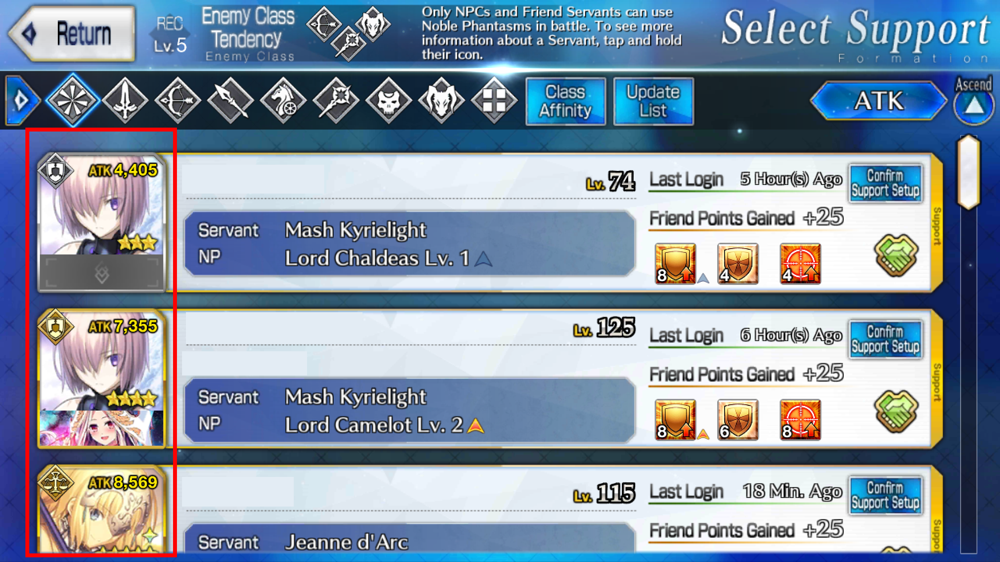

#AutoSupportSelection

## Preparing Screenshots
[The general guide to prepare a screenshot for recognition.](https://github.com/29988122/Fate-Grand-Order_Lua/wiki/How-to-take-a-screenshot-and-resize-properly)

The region cropped out can be anything, as long as it's inside the area outlined in red:


Put the filename(s) in the options ```Support_PreferredServants``` or ```Support_PreferredCEs```, accordingly.

## Support_PreferredServants and Support_PreferredCEs

Consider the following example:
```
Support_PreferredServants = "Any"
Support_PreferredServants = ""
(Putting "any" or leave it blank means that you don't care which servant it is.)

Support_PreferredCEs = "lunchtime.png, maid_in_halloween.png"
```
Then the script will search for:

• Any servant with CE Chaldea Lunchtime

• Any servant with CE Maid in Halloween

And select it **immediately** once the script found any of them. The script searches from the top to the bottom of the friend list. The reverse of the above example also stands true, i.e., waver.png with "Any" CE.

Consider another example:
```
Support_PreferredServants = "waver.png, tamamo.png"
Support_PreferredCEs = "*lunchtime.png, maid_in_halloween.png" 
(Prepend a * if you want to make sure it is MLB (Max Level Break, hence the star sign)).
```
And the script will search for:

• Waver + *Max Level Break* Lunchtime

• Waver + Maid in Halloween

• Tamamo + *Max Level Break* Lunchtime

• Tamamo + Maid in Halloween

And select it **immediately** once the script found any of them.

***

## Support_SelectionMode, Support_MaxUpdates, and Support_FallbackTo

If the servant/CE is not found in the support list, the script will click refresh as many times as defined in ```Support_MaxUpdates```.

If this limit is reached, the script will use the ```Support_FallbackTo``` option to decide what do next. The options are the same as in ```Support_SelectionMode```. So, for instance, if the script is set up like this:

```
Support_SelectionMode = "preferred"
Support_PreferredServants = "waver4.png"
Support_PreferredCEs = "*maid_in_halloween.png"
Support_MaxUpdates = 3
Support_FallbackTo = "first"
```

| waver4.png | maid_in_halloween.png |
| :---:      | :---:                 |
|   |   |

.... it will try to find Waver + a MLB Maid in Halloween CE in your support list. If it is not found in 3 refreshes maximum, the script will scroll back to top and pick the first visible servant.

The last option, ```Support_SwipesPerUpdate``` controls the number of swipes/servants before refreshing the screen.
If you have like 6 friend support servants, make it 6.